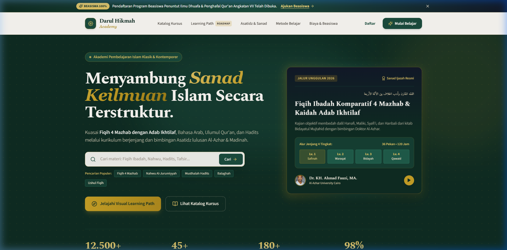

# Darul Hikmah Academy - Platform Kursus Online Islami Bersanad

<p align="center">
  
</p>

Darul Hikmah Academy adalah website platform kursus online Islam ilmiah bergaya editorial MOOC premium yang dibangun dengan Nuxt 3, TypeScript, dan Tailwind CSS. Website ini dirancang khusus untuk memfasilitasi pembelajaran ilmu syar'i klasik dan kontemporer dari jenjang pemula hingga bersanad secara terstruktur, interaktif, dan mudah diakses oleh santri, mahasiswa, profesional, maupun masyarakat luas. Platform ini mengusung kekayaan khazanah Turats Islam dengan tetap menjunjung tinggi prinsip adab ikhtilaf dan keterbukaan madzhab (*wasathiyah*).

---

## 🌟 Fitur Utama (Bahasa Awam)

1. **Jalur Belajar Visual Interaktif (Visual Learning Path Roadmap)**  
   Peta jalan belajar interaktif bertahap dari level pemula (*Ibtida'i*), menengah (*Mutawassith*), mahir (*Mutaqaddim*), hingga ujian sanad (*Takhassus*) pada 4 bidang keilmuan: Fiqih 4 Mazhab, Bahasa Arab, Ulumul Qur'an, dan Hadits. Mengklik tiap tahapan langsung membuka ringkasan kurikulum, silabus, dan buku rujukan turats.
2. **Katalog Kursus Lengkap & Filter Cerdas**  
   Pencarian materi yang cepat dan penyaringan kursus berdasarkan bidang kajian (Fiqih, Nahwu-Shorof, Tafsir, Hadits, Sirah Nabawiyah, Aqidah, Fiqih Muamalah Digital), tingkat kesulitan, serta opsi khusus kursus berijazah sanad.
3. **Profil Asatidz & Transmisi Sanad Keilmuan**  
   Daftar para pengajar dan masyayikh lulusan universitas Islam terkemuka (Universitas Al-Azhar Kairo, Universitas Islam Madinah, Universitas Umm Al-Qura Makkah, Darul Musthafa Tarim) lengkap dengan bagan silsilah ijazah sanad bersambung (*Sama' wa Qira'ah*).
4. **Pedagogi Belajar 4 Pilar Modern**  
   Penggabungan video rekaman studio berkualitas HD berteks matan Arab tersinkronisasi, halaqah tatap maya (*live streaming*) mingguan, evaluasi kuis mandiri, serta bimbingan musyrif pembina 1-on-1.
5. **Kepatuhan Adab Ikhtilaf Fiqih 4 Mazhab (Sesuai Lampiran C)**  
   Materi fikih disajikan secara objektif, berimbang, dan adil dengan memaparkan ragam ijtihad Mazhab Hanafi, Maliki, Syafi'i, dan Hanbali untuk menumbuhkan sikap toleran, persaudaraan, dan kedewasaan beragama.
6. **Formulir Pendaftaran & Beasiswa Penuntut Ilmu 100%**  
   Fitur simulasi pendaftaran kelas instan serta portal pengajuan beasiswa penuh bagi santri dhuafa, anak yatim, penghafal Al-Qur'an, dan asatidz di pelosok nusantara.
7. **Standar Aksesibilitas WCAG AA & Desain Responsif**  
   Dapat diakses dengan sangat nyaman melalui komputer, laptop, tablet, maupun layar smartphone dengan kontras warna tajam dan ukuran tombol sentuh ramah pengguna.
8. **Optimasi Mesin Pencari (SEO) & Schema JSON-LD Course**  
   Struktur metadata kaya (*Rich Snippets*) yang memudahkan mesin pencari Google membaca judul kursus, nama asatidz, dan biaya pendidikan secara otomatis.

---

## 🛠️ Stack Teknologi & Versi

- **Framework Utama**: [Nuxt 3](https://nuxt.com/) (`v3.14.x` / `v3.21.x`)
- **Library UI**: [Vue 3](https://vuejs.org/) (`v3.5.x`)
- **Bahasa Pemrograman**: [TypeScript](https://www.typescriptlang.org/) (`v5.7.x`) (Strict Mode)
- **Styling & CSS**: [Tailwind CSS](https://tailwindcss.com/) (`v3.4.x`) dengan modul `@nuxtjs/tailwindcss`
- **Ikonografi**: [Lucide Icons](https://lucide.dev/) (`lucide-vue-next` `v0.468.x`)
- **Testing Engine**: [Vitest](https://vitest.dev/) (`v2.1.x`) & Happy-DOM
- **Server Engine & Build**: Nitro Engine & Vite 7

---

## 📂 Struktur Folder Project

Berikut adalah susunan direktori penting dalam proyek ini:

```
19._Platform_Kursus_Online_Islami_(Akademi)/
├── app.vue                           # Template induk aplikasi (memuat Header Navbar, Top Bar, Konten Halaman, & Footer)
├── nuxt.config.ts                    # Konfigurasi inti Nuxt (modul Tailwind, font Google, meta SEO global)
├── tailwind.config.ts                # Konfigurasi tema warna (Deep Emerald, Cream, Gold, Navy, Charcoal) & font
├── tsconfig.json                     # Konfigurasi compiler TypeScript
├── package.json                      # Daftar pustaka dependensi dan skrip perintah proyek
├── vitest.config.ts                  # Konfigurasi pengujian otomatis unit test
├── assets/                           # Aset statis & style
│   └── css/
│       └── main.css                  # Berkas CSS global, aturan typography, tekstur arabesque, dan scrollbar
├── components/                       # Kumpulan komponen visual antarmuka pengguna
│   ├── catalog/                      # Komponen katalog kursus (CourseCard, CourseFilter, CourseDetailModal)
│   ├── common/                       # Komponen umum (Badge, Button, NotificationToast)
│   ├── hero/                         # Bagian pembuka website (HeroEditorial dengan pencarian & statistik)
│   ├── ikhtilaf/                     # Piagam dan kebijakan adab ikhtilaf 4 mazhab (IkhtilafPolicyCard)
│   ├── instructors/                  # Profil pengajar & jendela silsilah sanad (InstructorSection, SanadModal)
│   ├── layout/                       # Tata letak global (Navbar, Footer, TopNotificationBar)
│   ├── methodology/                  # Penjelasan 4 pilar metode belajar (LearningMethodology)
│   ├── pricing/                      # Daftar harga, beasiswa, form pendaftaran (PricingSection, EnrollmentModal, ScholarshipModal)
│   ├── roadmap/                      # Fitur unggulan Visual Learning Path Roadmap (LearningPathRoadmap, RoadmapNodeModal, RoadmapTrackSelector)
│   └── testimonials/                 # Bagian testimoni dan ulasan alumni santri (StudentTestimonials)
├── composables/                      # Logika reaktif Vue (State Management)
│   ├── useCourses.ts                 # Logika pencarian, filter kategori, level, dan modal kursus
│   ├── useEnrollment.ts              # Logika proses pendaftaran, checkout simulasi, dan notifikasi
│   └── useLearningPaths.ts           # Logika interaktif perpindahan jalur dan seleksi node roadmap
├── data/                             # Berkas basis data lokal (Data Layer)
│   ├── coursesData.ts                # Data rincian seluruh materi kursus, modul, silabus, dan catatan fiqih
│   ├── instructorsData.ts            # Data profil asatidz, almamater, dan rantai sanad keilmuan
│   ├── learningPathsData.ts          # Data jalur keilmuan dan tahapan tingkatan roadmap
│   ├── pricingData.ts                # Data daftar paket biaya pendidikan dan fitur yang didapatkan
│   └── testimonialsData.ts           # Data testimoni pengalaman belajar santri
├── pages/                            # Struktur halaman website berbasis rute otomatis Nuxt
│   └── index.vue                     # Halaman beranda utama yang menggabungkan seluruh seksi dan schema SEO JSON-LD
├── public/                           # Berkas statis publik yang dapat diakses langsung oleh browser
│   ├── favicon.svg                   # Ikon favicon geometris islami
│   └── images/                       # Tempat meletakkan gambar lokal (foto asatidz, banner, logo)
├── tests/                            # Berkas pengujian kode
│   └── courses.test.ts               # Unit test untuk validasi data kursus, roadmap, dan adab ikhtilaf
├── README.md                         # Dokumen panduan utama proyek
└── tutorial.md                       # Panduan teknis komprehensif 15 langkah bagi pengelola / yayasan non-programmer
```

---

## 🚀 Cara Menjalankan Project

Ikuti 3 langkah mudah berikut untuk menjalankan website di komputer Anda:

### 1. Pasang Dependensi
Buka Terminal / Command Prompt pada folder project ini, lalu jalankan:
```bash
npm install
```

### 2. Jalankan Server Pengembangan (Development Server)
Jalankan perintah berikut:
```bash
npm run dev
```

### 3. Buka di Browser
Buka peramban web (Google Chrome, Firefox, Safari, atau Edge) lalu akses tautan:
```
http://localhost:3000
```
Website siap dijelajahi dengan fitur *hot-reload* (setiap perubahan kode langsung tampak tanpa perlu restart server manual).

---

## 📚 Panduan Lengkap Kustomisasi

Untuk panduan mendalam langkah-demi-langkah bagi pengelola yayasan, pengurus ma'had, atau pemilik lembaga kursus mengenai cara mengganti harga, menambah materi kursus baru, mengubah nomor WhatsApp, mengatur SEO, hingga mengunggah ke hosting, silakan buka dan baca berkas:
👉 **[tutorial.md](file:///d:/website%20claude/Website%202/2.Islami_Premium_Vue_Nuxt_Tailwind/19._Platform_Kursus_Online_Islami_%28Akademi%29/tutorial.md)** (memuat 15 bab tutorial ramah pemula).

---

## 📜 Catatan Lisensi Font & Aset

- **Tipografi Display (Spectral)**: Disediakan oleh Production Type melalui [Google Fonts](https://fonts.google.com/specimen/Spectral) di bawah lisensi *Open Font License (OFL)*.
- **Tipografi Teks Tubuh (Source Sans 3)**: Disediakan oleh Adobe melalui [Google Fonts](https://fonts.google.com/specimen/Source+Sans+3) di bawah lisensi *Open Font License (OFL)*.
- **Tipografi Aksara Arab (Amiri)**: Font naskhi klasik karya Khaled Hosny melalui [Google Fonts](https://fonts.google.com/specimen/Amiri) di bawah lisensi *Open Font License (OFL)*.
- **Ikonografi**: [Lucide Icons](https://lucide.dev/) di bawah lisensi *ISC License*.
- **Foto Ilustrasi & Asatidz**: Foto contoh kurasi dari [Unsplash](https://unsplash.com/) di bawah lisensi bebas royalti untuk penggunaan editorial & pembelajaran. Disarankan mengganti dengan foto asli asatidz yayasan sebelum dipublikasikan.
